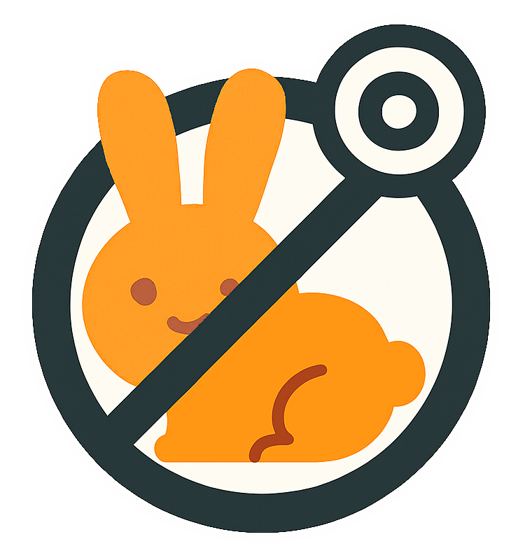

# NoShorts

A simple Chrome-based web extension that blocks and redirects YouTube Shorts to help you stay focused and avoid distractions.

## ✨ Features

-   🚫 Blocks YouTube Shorts sidebar button.
-   🔥 Hides YouTube Shorts feed.
-   🔁 Automatically redirects Shorts URLs to their regular video counterparts.
-   ⚡ Lightweight and fast — no unnecessary bloat.
-   🔒 100% privacy-friendly — works locally in your browser.

## 📦 Installation

1. Clone or download this repository.
2. Open **your browser** and go to

    | In brave              | In chrome              | In edge              |
    | --------------------- | ---------------------- | -------------------- |
    | `brave://extensions/` | `chrome://extensions/` | `edge://extensions/` |

3. Enable **Developer mode** (toggle in the top right).
4. Click **Load unpacked** and select the extension folder.

## 🛠 How It Works

The extension monitors tab URLs and checks for patterns matching YouTube Shorts (`youtube.com/shorts/*`). When detected, it redirects them to the standard video format (`youtube.com/watch?v=*`) using the video ID. It also blocks the youtube shorts sidebar button and hides the youtube shorts feed.

## 💡 Motivation

YouTube Shorts can be a major distraction and lead to time-wasting. This extension was built to help people regain focus by eliminating that endless scroll.
